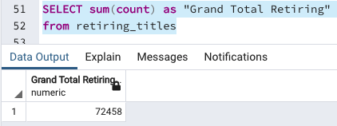
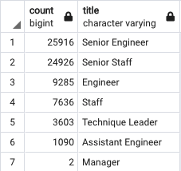
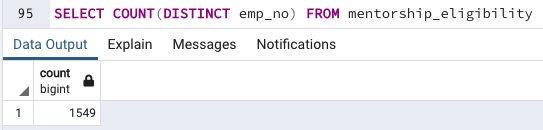
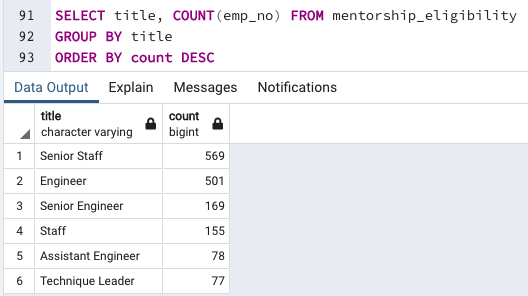
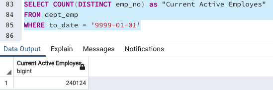

# Pewlett-Hackard-Analysis

## Overview of the Analysis

The purpose of this challenge is to use SQL statements to analyze a database with employee information. More specifically, we need to determine the number of retiring employees per title and identify employees who are eligible to participate in a mentorship program.

## Results

- A total of 72,458 employees are expected to retire.

 

- The majority of the employees retiring will be senir engineers and senior staffs

- There are 1,549 employees that qualify in the mentorship eligibility program.

- There are no eligible managers to enter the mentorhsip program .

## Summary

In summary, there are currently 240,124 active employees at Pewlett Hackard, a total of 72,458 of these employees are expected to retire in the "silver tsunami". Currently, there are not enough qualified retirement-ready employees to mentor the next generation of "Managers" at Pewelett Hackard.

