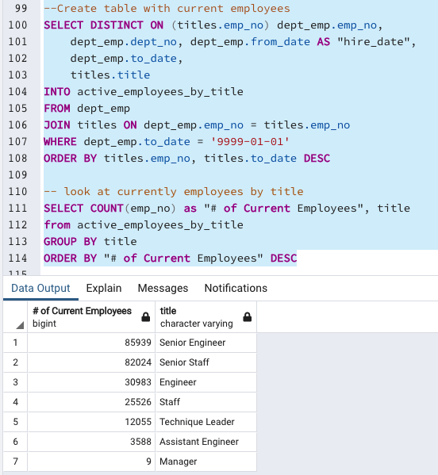

# Pewlett-Hackard-Analysis

## Overview of the Analysis

The purpose of this challenge is to use SQL statements to analyze a database with employee information. More specifically, we need to determine the number of retiring employees per title and identify employees who are eligible to participate in a mentorship program. To perform this analysis we will be exporting and importing csv files from and to pgADMIN. We will also be using JOIN, ORDER BY, WHERE, and SELECT statements among others.

## Results

- A total of 72,458 employees are expected to retire. This is obtained by adding the counts of employees retiring in the retiring_titles table (count column), which can be found in the Data folder.

 

- The majority of the employees retiring will be senior engineers and senior staffs. This can be found in the retiring_titles table which can be found in the Data folder.

- There are 1,549 employees that qualify in the mentorship eligibility program. This is obtained by counting the number of unique employee numbers/identifiers in the mentorship_eligibility table, which can be found in the Data folder.

- There are no eligible managers to enter the mentorhsip program. This can be found grouping by title the data from the mentorship_eligibiltiy table.

## Summary

In summary, there are currently 240,124 active employees at Pewlett Hackard, a total of 72,458 of these employees are expected to retire in the "silver tsunami". Currently, there are not enough qualified retirement-ready employees to mentor the next generation of "Managers" at Pewelett Hackard. Lastly, currently there are only 9 active managers. This seems odd when looking at the total number of employees.

